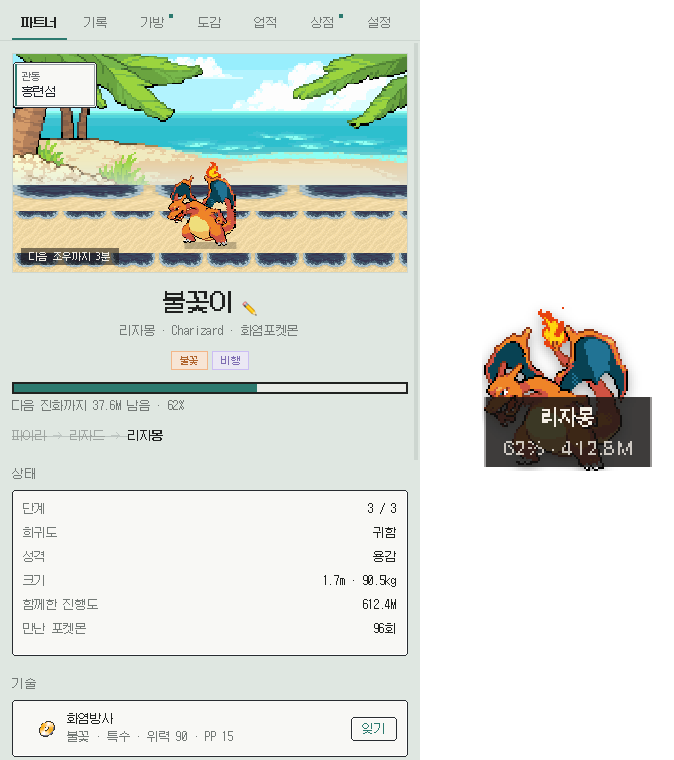
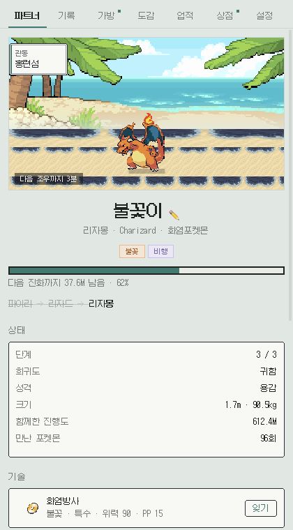
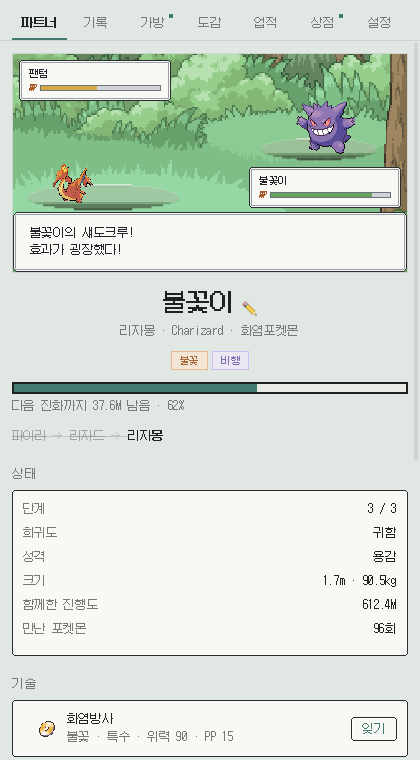
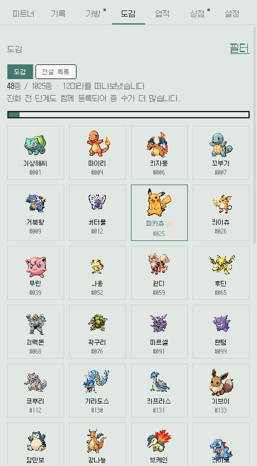
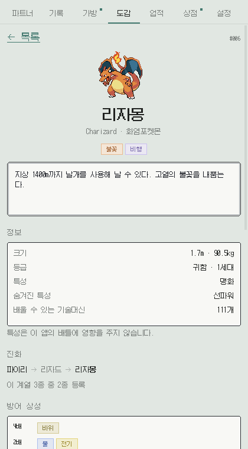
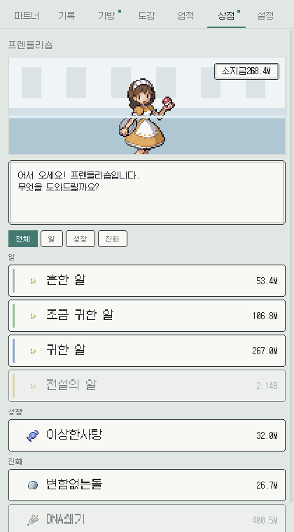
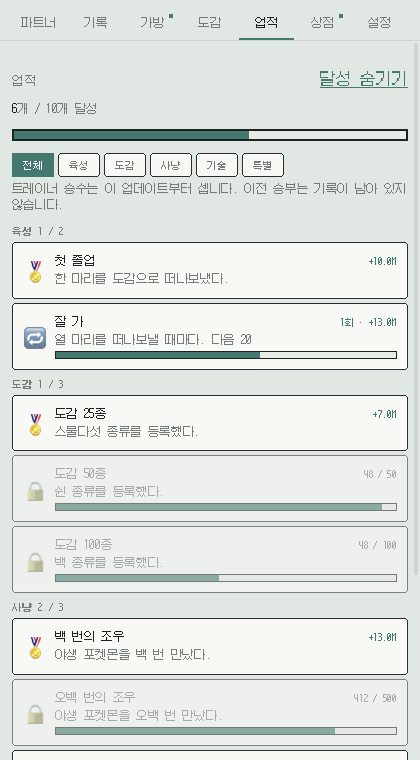
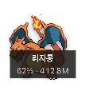

# PokeTokenPet

### AI로 코딩한 만큼 포켓몬이 자랍니다

메뉴바(macOS) · 트레이(Windows)에 사는 작은 육성 게임. 
Claude Code로 일하면 알이 부화하고, 진화하고, 도감이 채워집니다.

[**⬇ 내려받기**](../../releases) · [설치 안내 (Mac)](docs/MACOS.md) · [설치 안내 (Windows)](docs/WINDOWS.md)

> **English** — PokeTokenPet is a menubar/tray pet that grows from your Claude Code
> token usage. It reads only the token counts in `~/.claude/projects` — never the
> content of your conversations — and sends nothing anywhere. Free, no account, no ads.
> Downloads for macOS and Windows are on the [releases page](../../releases).
>
> ⚠️ *Unofficial fan project. Not affiliated with Nintendo / Creatures / GAME FREAK /
> The Pokémon Company / Anthropic. Pokémon is their trademark. This project ships no
> Pokémon assets — see [NOTICE.md](NOTICE.md).*

---

## 받기

| 내 컴퓨터 | 받을 파일 |
|---|---|
| **Mac** (M1~M4) | `PokeTokenPet-<버전>-arm64-mac.dmg` |
| **Mac** (Intel) | `PokeTokenPet-<버전>-x64-mac.dmg` |
| **Windows** | `PokeTokenPet-<버전>-x64-win.zip` |
| **Windows** (ARM) | `PokeTokenPet-<버전>-arm64-win.zip` |

어느 쪽인지 모르겠으면 — Mac은 애플 메뉴  → **이 Mac에 관하여** → `칩`에 Apple이 있으면 arm64입니다.

**첫 실행에 경고가 뜹니다.** 코드 서명을 하지 않은 개인 프로젝트라 macOS는 "손상되었습니다",
Windows는 SmartScreen 창을 띄웁니다. 바이러스가 아니라 **인증서가 없다**는 뜻이고,
넘어가는 방법이 [Mac](docs/MACOS.md) · [Windows](docs/WINDOWS.md) 문서에 한 단계씩 있습니다.

**Claude Code를 쓴 적이 있어야** 셀 토큰이 있습니다. 없어도 앱은 정상적으로 뜨고 0에서 기다립니다.

---

## 이런 게임입니다

### 🥚 일하면 자랍니다

따로 할 일이 없습니다. 평소처럼 Claude Code로 코딩하면 그게 곧 경험치입니다.

알이 부화하고, 진화하고, 최종 단계에서 충분히 자라면 **졸업**해서 도감에 남고 새 알이 옵니다.

부화 임계값은 **최근 7일 평균의 15%**로 자동 조정됩니다. 하루 종일 붙어 있는 사람이든
가끔 쓰는 사람이든, 1~2시간쯤 쓰면 알이 깨지도록 맞춰집니다.

펫은 가만히 서 있지 않습니다. **지방을 여행하고**, 지금 어디인지는 왼쪽 위 표지판이 말해 줍니다.
화면 색은 **실제 시각을 따라** 아침·낮·저녁·밤으로 바뀝니다.

 

### ⚔️ 안 보는 동안에도 싸웁니다

코딩을 쉬는 동안 펫이 **5분에 한 번** 야생 포켓몬과 싸웁니다. 앱을 꺼 둔 시간도
**최대 8시간까지 소급 정산**하니 노트북을 닫고 퇴근해도 손해가 없습니다.

연출이 아니라 **진짜 배틀**입니다. HP가 실제로 닳고, 타입 상성이 계산되고,
급소와 상태이상이 뜨고, 지면 집니다.

다만 사냥에는 **상한**이 있습니다 — 켜두기만 한 기계가 혼자 도감을 채우지 못하도록.
이 앱의 전제가 "일한 만큼 자란다"라서, 그걸 지키는 쪽을 골랐습니다. (설정에서 끌 수 있습니다.)

 

### 📖 1025종을 모읍니다

1세대부터 9세대까지 **전부** 있습니다. 희귀도에 따라 출현 빈도와 성장 속도가 다르고,
**샤이니는 1/512**로 부화할 때 한 번 굴려 고정됩니다.

떠나보낸 포켓몬은 스프라이트와 함께 카드로 쌓입니다. 카드를 누르면
종족값·방어 상성·진화 계보·도감 설명, 그리고 **그 아이와 함께한 기록**이 나옵니다.

전설과 환상은 그냥 나오지 않습니다. **조건을 갖춰야** 만납니다 — 지방 도감을 채우거나,
전용 도구를 모으거나, 트레이너를 이기거나.

 

<b>도감 상세 화면 보기</b>
 

키·무게·등급·특성·배울 수 있는 기술머신 수, 진화 계보에서 내가 몇 종을 채웠는지,
그리고 18타입 방어 상성표까지 한 장에 들어갑니다.

### 🏪 번 걸 쓰고, 다음 목표를 받습니다

<table>
<tr>
<td width="50%"></td>
<td width="50%"></td>
</tr>
<tr>
<td><b>상점</b> — 번 토큰으로 이상한사탕·변함없는돌·알을 삽니다. 원작처럼 점원이 있고 대화창이 뜹니다.</td>
<td><b>업적</b> — 다음에 뭘 해볼지 알려줍니다. 반복 업적은 몇 번이든 다시 달성됩니다.</td>
</tr>
</table>

### 🖥️ 화면 위에 그냥 둡니다

항상 위에 뜨는 작은 창으로 펫을 꺼내 둘 수 있습니다. 드래그로 옮기고, 휠로 키우고,
더블클릭으로 패널을 엽니다. 마우스를 올리면 이름과 진행률이 뜹니다.

**클릭 통과**를 켜면 마우스를 아예 받지 않아서, 뒤에 있는 창을 그대로 쓸 수 있습니다.

 

---

## 왜 이 앱인가

- **따로 할 게 없습니다.** 이미 하고 있는 일이 그대로 게임이 됩니다
- **아무것도 밖으로 나가지 않습니다.** 서버도, 계정도, 분석도, 광고도, 결제도 없습니다.
  대화 **내용은 읽지 않습니다** — 메시지마다 붙은 토큰 수·모델·시각만 봅니다
- **정직하게 설계했습니다.** 자동사냥에 상한을 둬서, 켜두기만 한 기계는 도감을 못 채웁니다
- **화면이 한 언어로 말합니다.** 9-slice 창틀, 픽셀 폰트(갈무리), 둥근 모서리 없음 — 전부 도트
- **Windows와 macOS 둘 다**, 그리고 **무료**입니다

---

## 자주 묻는 것

<b>제 대화 내용을 읽나요?</b>
 

아니요. 트랜스크립트에서 읽는 건 **토큰 수·모델 이름·시각·어느 클라이언트에서 썼는지**뿐입니다.
대화 본문(`message.content`)은 **접근조차 하지 않습니다.** 궁금하시면
[`server/usage.ts`](server/usage.ts)의 `parseLine`을 보세요 — 40줄입니다.

<b>어디로 보내나요?</b>
 

아무 데도 안 보냅니다. 서버가 없고, 로그인이 없고, 분석이나 크래시 리포트도 없습니다.
바깥으로 나가는 통신은 **포켓몬 스프라이트를 처음 받아올 때뿐**이고, 받은 건 내 컴퓨터에만 캐시됩니다.

<b>인터넷이 필요한가요?</b>
 

스프라이트를 처음 볼 때만 필요합니다. 못 받아도 **연출만 빠지고 게임은 그대로 돌아갑니다** —
배경이 안 오면 원래 쓰던 그라데이션이 그대로 남는 식입니다.

<b>Claude Code가 없으면요?</b>
 

앱은 정상적으로 뜨고 0에서 기다립니다. 고장 나지 않습니다.

<b>용량은 얼마나 쓰나요?</b>
 

내려받기 약 130MB. 스프라이트 캐시가 쓰면서 최대 36MB까지 자라는데, 설정 탭에서 정리할 수 있습니다.

<b>지우려면?</b>
 

앱을 지우고 `~/.poketokenpet/` 폴더를 삭제하면 완전히 사라집니다.
`~/.claude/`는 이 앱이 만든 게 아니니 건드리지 마세요.

<b>제 포켓몬을 다른 컴퓨터로 옮길 수 있나요?</b>
 

아직 안 됩니다. `~/.poketokenpet/state.json`을 직접 복사하면 되긴 하지만,
정식 내보내기/불러오기는 다음 버전 과제입니다.

---

## 개발자세요?

소스는 전부 여기 있고, `npm install && npm run electron:dev`면 돕니다 (Node 22 이상).

| 문서 | 내용 |
|---|---|
| [docs/DESIGN.md](docs/DESIGN.md) | **게임 기획** — 밸런스, 시스템, 각 숫자가 왜 그 값인지 |
| [docs/INTERNALS.md](docs/INTERNALS.md) | **구현 노트** — 토큰 파서의 함정 다섯 개, 화면과 에셋 |
| [docs/DEVELOPMENT.md](docs/DEVELOPMENT.md) | **개발 · 빌드 · 배포** — 이어서 개발하고 릴리스 내는 법 |

## 라이선스 · 고지

코드는 [MIT](LICENSE)입니다.

**이 저장소는 포켓몬 스프라이트를 재배포하지 않습니다.** 스프라이트는 실행 중에
사용자 기기가 직접 받아 로컬에만 캐시합니다. 커밋된 그림은 직접 그린 UI, CC0 타일셋,
그리고 위 스크린샷뿐이고, 폰트는 [갈무리](https://github.com/quiple/galmuri)(SIL OFL-1.1)입니다.

포켓몬은 닌텐도 / 크리처스 / 게임프리크의 상표이자 저작물입니다.
전문과 출처표는 **[NOTICE.md](NOTICE.md)**에 있습니다.
