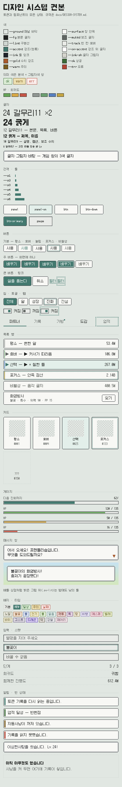

# 디자인 시스템

PokeTokenPet의 화면은 **DS 시절 포켓몬 게임의 메뉴처럼** 보이고 움직여야 합니다. 이 문서는 그걸
가능하게 하는 규칙과 부품을 모읍니다. 이 문서가 기준이고, 코드는 이 문서를 따릅니다.

| 층 | 파일 | 내용 |
|---|---|---|
| 토큰 | `src/tokens.css` | 색·글자·간격·선·깊이·모션 값 |
| 틀 | `src/ui-*.png` ← `scripts/gen-ui.ts`, `src/battleui.ts` | 직접 그린 9-slice 틀 |
| 컴포넌트 | `src/ui.css`, `src/uikit.ts` | `px-` 접두사 부품, HP 색 판정 |
| 견본 | `specimen.html`, `src/specimen/` | 모든 부품·상태를 한 화면에. 개발 전용 |
| 지킴이 | `test/panel-css.test.ts`, `test/uikit.test.ts` | 아래 원칙을 기계로 확인 |

견본은 `npm run dev` 후 `/specimen.html`로 열거나, `npm run gen:specimen`으로
`docs/img/ds-light.png`와 `docs/img/ds-dark.png`를 만들어 봅니다.



---

## 원칙

1. **4px 격자, 주단위 8px.** 모든 간격은 `--s1..--s6`(2/4/8/12/20/32)에서 고릅니다. 그림(스프라이트,
   틀 그림)만 자기 크기를 가집니다.
2. **선은 1, 2, 4px뿐.** 3px은 9-slice 틀의 조각 크기일 때만 씁니다. 0.5px은 없습니다. 홀수 폭에
   `translate(-50%)`를 걸어 .5px에 떨어지게 하지 않습니다.
3. **둥근 모서리, 흐림, 번진 그림자는 없습니다.** 모서리는 틀 그림이 대각선으로 깎고, 그림자가
   필요하면 흐림 0의 딱딱한 그림자를 씁니다.
4. **상태는 틀 교체, 위치 이동, 커서로 보여 줍니다. 불투명도로는 보여 주지 않습니다.** 호버하면
   눌린 틀이 되고, 누르면 1px 내려가고, 선택하면 ▶ 커서와 칠한 틀이 붙습니다. 비활성은 음각 글자로
   표시합니다. 흐리게 만든 요소는 배경과 섞여 대비를 잃기 때문입니다.
5. **포커스와 선택은 다르게 생깁니다.** 선택은 ▶와 칠한 틀, 키보드 포커스는 틀 안쪽 2px 점선입니다.
   둘이 겹쳐도 둘 다 보입니다.
6. **글자는 Galmuri의 원본 크기만 씁니다.** 8/10/12px과 12px의 2배인 24px. 줄 높이는 크기 + 4px.
   굵게는 12px과 24px에서만(진짜 굵은 글꼴은 Galmuri11 Bold 하나뿐입니다).
7. **게임 창의 글자는 3색입니다.** 잉크, 오른쪽 아래 1px 그림자(검정이 아닌 그림자색), 바탕.
8. **의미 색은 쌍으로 다닙니다.** `--ok`와 `--ok-sh`처럼 본색과 그 뒤에 까는 색이 짝입니다.
   색만으로 뜻을 전하지 않고 글자나 숫자를 함께 씁니다.
9. **남은 양을 뜻하는 막대는 HP 규칙을 따릅니다.** 절반 위는 초록, 5분의 1 위는 노랑, 그 아래는
   빨강입니다. 판정은 비율이 아니라 채워진 픽셀 수로 하고(`hpLevel`), 숫자는 항상 옆에 둡니다.
10. **모션은 프레임 단위 계단입니다.** 길이는 `--f1..--f32`(60Hz 프레임 배수), 타이밍은
    `steps()`입니다. ease나 cubic-bezier는 쓰지 않습니다. 모션을 줄이는 설정에서는 전부 멈춥니다.
11. **누를 수 있는 것은 최소 24×24입니다**(`--hit`). 작은 아이콘도 누를 영역은 24px로 채웁니다.
12. **본문 대비 4.5:1 이상.** 그림자는 대비 계산에 넣지 않습니다. 아래 대비 표가 기준입니다.

---

## 레퍼런스

| 레퍼런스 | 가져온 것 |
|---|---|
| [pret/pokeemerald](https://github.com/pret/pokeemerald) (에메랄드 디컴파일) | HP 막대 48px, 초록 > 50%, 노랑 > 20%, 판정은 픽셀로(`GetHPBarLevel`) → `hpLevel()`. 메뉴 글자는 잉크 `#626262` + 그림자 `#D5D5CD` 3색 → `--text-sh`. 의미 색은 본색·그림자색 쌍 → `--ok`/`--ok-sh`. 8×8 타일 격자. 더 있음 ▼는 0/1/2/1px로 튐 → `.px-window-more` |
| [98.css](https://jdan.github.io/98.css/) | 누르면 명암이 뒤집히고 내용이 1px 이동. 포커스는 점선, `outline-offset: -4px` → `--focus-offset`. 비활성은 투명도 대신 음각 글자 |
| [NES.css](https://github.com/nostalgic-css/NES.css) | 색마다 본색·호버·그림자 3단. 호버는 한 단계 어둡게 할 뿐 흐리게 하지 않음 |
| [RPGUI](https://github.com/RonenNess/RPGUI), [Kenney Pixel UI Pack](https://kenney.nl/assets/pixel-ui-pack), [Saint11 튜토리얼](https://saint11.art/blog/pixel-art-tutorials/) | 틀은 9-slice로, 모서리는 늘리지 않음. 눌린 틀은 같은 모양이 내려간 것. 이미지는 pixelated |
| [Galmuri](https://github.com/quiple/galmuri) | 원본 크기: Galmuri7 = 8px, 9 = 10px, 11 = 12px, 14 = 15px. 정수배에서만 선명함. Galmuri7은 한글 4,358자뿐이라 이름에 쓰지 않음. 굵게는 Galmuri11 Bold만 |
| [WCAG 2.2](https://www.w3.org/TR/WCAG22/) 1.4.3, 2.5.8 | 본문 대비 4.5:1, 누를 영역 24×24, 모션 줄이기 |

틀 그림은 원작에서 가져오지 않고 `scripts/gen-ui.ts`가 직접 그립니다. 원작 UI를 그대로 옮긴 것은
전부 닌텐도의 에셋이고, 이 저장소는 포켓몬 에셋을 싣지 않기 때문입니다. 게임 화면처럼 읽히게
하는 것은 **배치**(대각선의 명판, 아래에 붙은 긴 메시지 창, 초록·노랑·빨강 막대)이지 틀 모양
자체가 아닙니다.

---

## 토큰

모두 `src/tokens.css`의 `:root`에 있습니다. 다크 모드 값은 같은 파일의 `prefers-color-scheme: dark`
블록에 있습니다. 설정 화면의 테마 선택은 없고, 운영체제 설정을 따릅니다.

### 색

| 토큰 | 밝음 | 어두움 | 용도 |
|---|---|---|---|
| `--ground` | `#dfe7e1` | `#14181a` | 패널 바닥. 창이 놓이는 들판 |
| `--surface` | `#f8f8f4` | `#252a2d` | 창 안쪽. 글이 실제로 놓이는 곳 |
| `--fg` | `#1f2220` | `#e8ebe6` | 본문 |
| `--muted` | `#5f6663` | `#8b918c` | 보조 글자, 라벨 |
| `--line` | `#cdd6d0` | `#39434a` | 구분선, 점선 테두리 |
| `--track` | `#e8ebe7` | `#1b2023` | 빈 칸, 호버 바탕 |
| `--accent` | `#2c7a6f` | `#4fb3a3` | 강조, 선택, 커서. 어떤 타입도 쓰지 않는 청록 |
| `--on-accent` | `#fff` | `#fff` | 강조 채움 위의 글자 |
| `--ink` / `--paper` | 틀 잉크/바탕 | 반전 | 9-slice 틀과 같은 색. 창 속 글자 |
| `--ink-lit` | `#20232a` | 같음 | 밝은 그림(배틀·상점) 위의 글자 |
| `--gold` | `#b4531d` | `#e0a06a` | 메시지 창의 수치 |
| `--ok` · `--ok-sh` | `#276b31` · `#d9eed5` | `#7cc98a` · `#1e3a24` | 성공, 달성 |
| `--warn` · `--warn-sh` | `#7e5a0c` · `#f1e0ad` | `#e0a52a` · `#3d3014` | 주의 |
| `--err` · `--err-sh` | `#c0392b` · `#fcecea` | `#e0685c` · `#3a1714` | 오류, 실패 |
| `--ink-sh` / `--text-sh` | `#d5d5cd` | `#14181a` | 글자 그림자 1px |
| `--ink-sh-lit` / `--text-sh-lit` | `#d5d5cd` | 같음 | 밝은 그림 위의 글자 그림자 |
| `--hp-hi` · `--hp-mid` · `--hp-lo` | `#4fa64f` · `#e0a52a` · `#d24b3f` | 같음 | HP 막대. 배틀 장면은 늘 밝으므로 테마를 따르지 않음 |
| `--rar-common..legendary` | `#8d9691` `#5aa06b` `#4a80c4` `#c9a227` | 같음 | 희귀도 띠 |
| `--t-normal..--t-fairy` | 공식 타입 색 18개 | 같음 | 칠하지 않고, 창 색 쪽으로 섞어서 씀 |

**디자인 시스템과 함께 바뀐 값은 둘입니다.** 밝은 테마의 `--muted`(`#737a77` → `#5f6663`)와
`--warn`(`#a97a12` → `#7e5a0c`)입니다. 이전 값은 창 바탕 위에서 4.1:1과 3.3:1로 기준에 못 미쳤습니다.

#### 대비 (WCAG, 그림자 제외)

| 쌍 | 밝음 | 어두움 |
|---|---|---|
| `--fg` / `--surface` | 15.1 | 12.1 |
| `--muted` / `--surface` | 5.5 | 4.5 |
| `--muted` / `--ground` | 4.7 | 5.6 |
| `--accent` / `--surface` | 4.8 | 5.7 |
| `--on-accent` / 주 버튼 채움 `#2c7a6f` | 5.1 | 5.1 |
| `--ok` / `--ok-sh` | 5.3 | 6.3 |
| `--warn` / `--warn-sh` | 4.8 | 5.9 |
| `--err` / `--err-sh` | 4.8 | 4.8 |
| `--gold` / `--surface` | 4.7 | 6.5 |

주 버튼의 채움은 두 테마 모두 `#2c7a6f`입니다. 밤의 밝은 청록 위에서는 흰 글자가 2.5:1밖에
나오지 않기 때문입니다.

### 글자

| 토큰 | 값 | 글꼴 | 쓰는 곳 |
|---|---|---|---|
| `--fs-xl` / `--lh-xl` | 24 / 28px | Galmuri11 ×2 | 이름, 큰 수치 |
| `--fs-md` / `--lh-md` | 12 / 16px | Galmuri11 | 본문, 목록, 버튼(기본) |
| `--fs-sm` / `--lh-sm` | 10 / 14px | Galmuri9 | 설명, 캡션, 보조 수치, 배지 |
| `--fs-xs` / `--lh-xs` | 8 / 12px | Galmuri7 | 고정 라벨 전용(HP, Lv). 이름이나 사용자 입력에는 쓰지 않음 |
| `--face-md/sm/xs` | 글꼴 + 대체 글꼴 | | 이모지(🥚 ✨)는 시스템 글꼴에서 옴 |
| `--font-bold` | 700 | Galmuri11 Bold | 12px, 24px에서만 |

`font: var(--fs-md) / var(--lh-md) var(--face-md)`처럼 크기·줄 높이·글꼴을 **항상 함께** 지정합니다.
크기만 바꾸고 글꼴을 그대로 두면 12px 글꼴이 10px로 줄어들며 뭉개집니다.

### 간격 · 크기 · 선

| 토큰 | 값 | |
|---|---|---|
| `--s1..--s6` | 2 · 4 · 8 · 12 · 20 · 32 | 간격 |
| `--pad-box` / `--pad-tight` | 8 / 4 | 상자 안쪽 / 컨트롤 안쪽 |
| `--ctl` / `--ctl-lg` | 24 / 32 | 컨트롤 높이 |
| `--hit` | 24 | 최소 누를 영역 |
| `--rail` / `--gutter-cursor` | 8 / 20 | 스크롤바 폭 / ▶ 커서 칸. 간격이 아님 |
| `--bw-1/2/4` | 1 · 2 · 4 | 선 두께 |
| `--gauge-h` / `--gauge-hp-h` | 12 / 8 | 게이지 바깥 높이(틀 포함) |

### 깊이 · 모션 · 포커스

| 토큰 | 값 | |
|---|---|---|
| `--z-base/raised/sticky/overlay/toast` | 0 · 1 · 2 · 10 · 20 | 쌓임 순서 |
| `--f1 --f2 --f4 --f8 --f16 --f32` | 1 · 2 · 4 · 8 · 16 · 32 프레임 | 60Hz 기준 길이 |
| `--step` / `--step-blink` | `steps(4, end)` / `steps(1, end)` | 타이밍 |
| `--focus-w` / `--focus-offset` | 2px / −4px | 틀 안쪽 점선 커서 |

### 틀 (9-slice)

`battleUiVars()`가 요소에 인라인으로 넣습니다(`App`, `PetApp`, `Scene`, 견본). 조각 값은 단위 없는
숫자입니다. px를 붙이면 조용히 무시되고 틀이 사라집니다.

| 변수 | 크기·조각 | 용도 | 다크 |
|---|---|---|---|
| `--ui-window` | 18×18 · 6 | 메시지 창, 토스트 | 있음 |
| `--ui-plate` | 12×12 · 4 | 배틀 명판 | 있음 |
| `--ui-panel` | 10×10 · 3 | 목록 행, 카드, 알림 | 있음 |
| `--ui-panel-on` | 10×10 · 3 | 선택된 행·카드(청록 쪽으로 칠함) | 있음 |
| `--ui-btn` / `--ui-btn-down` | 10×10 · 3 | 버튼 평소 / 눌림 | 있음 |
| `--ui-btn-primary(-down)` | 10×10 · 3 | 주 버튼 평소 / 눌림 | 있음 |
| `--ui-gauge` | 6×6 · 2 | 게이지와 입력칸의 움푹한 칸 | 있음 |
| `--ui-sign` · `--ui-case` · `--ui-bang` | | 지명 표지판, 배지 케이스, ! 말풍선 | 없음(늘 밝은 그림 위) |

---

## 컴포넌트

모든 부품은 `src/ui.css`에 있고 `px-`로 시작합니다. 견본에서 상태를 고정할 때는 `is-hover`,
`is-active`, `is-focus`, `is-selected`, `is-disabled` 클래스를 씁니다. 실제 화면에서는 가상 클래스와
aria 속성이 그 역할을 합니다.

**밝은 그림 안(`.px-lit`)** — 배틀 장면, 상점 카운터처럼 시간과 상관없이 밝은 그림 위에 놓인
부품은 밤에도 낮의 틀과 잉크를 씁니다.

### Button — `.px-btn`

| 변형 | 클래스 | 언제 |
|---|---|---|
| 기본 | `.px-btn` | 대부분의 동작: 사용, 잊기, 취소 |
| 주 | `.px-btn--primary` | 그 화면에서 가장 하고 싶은 동작 하나. 한 화면에 최대 하나 |
| 링크 | `.px-btn--link` | 글 속의 동작: 필터, 더 보기 |
| 크게 | `.px-btn--lg` | 확인 묻기의 예/아니오, 화면 끝의 큰 동작 |

| 상태 | 모습 | 동작 |
|---|---|---|
| 평소 | 밝은 틀, 윗면과 왼쪽에 하이라이트 | |
| 호버 | 눌린 틀, 글자 청록(주 버튼은 흰색 유지) | 포인터를 올리면 가라앉음 |
| 눌림 | 눌린 틀 + 1px 아래로 | |
| 포커스 | 틀 안쪽 2px 점선(주 버튼은 흰 점선) | 키보드로만 보임(`:focus-visible`) |
| 비활성 | 틀은 그대로, 글자는 음각 | 누를 수 없음. 투명도 없음 |

- **역할:** `<button>`. 아이콘만 있는 버튼에는 `aria-label`을 붙입니다.
- **키보드:** Tab으로 이동, Enter/Space로 누름.

| ✅ 할 것 | ❌ 하지 말 것 |
|---|---|
| 동사로 짧게: 사용, 배우기 | 주 버튼 두 개를 나란히 |
| 비활성이면 옆에 이유를 적기 | `opacity`로 비활성 표시 |

```html
<button class="px-btn px-btn--primary">배우기</button>
<button class="px-btn">잊기</button>
<button class="px-btn px-btn--link">필터</button>
```

**흡수되는 기존 버튼 7종:** `.items button:not(.rowbtn)`(필 버튼), `.pager button`,
`.saywin-ask button`, `.sizes button`, `.linky`, `.namebtn`, `.chips button`. 뒤의 둘은 각각
링크와 칩으로 갑니다.

### Chip / Segment — `.px-chips` > `.px-chip`

필터와 크기 선택처럼 **여럿 중에 고르는 것**에 씁니다. 고른 칩은 주 버튼의 틀을 씁니다.
상태는 클래스가 아니라 `aria-pressed="true"`로 표시합니다. 하나만 고르는 세그먼트는
`role="radiogroup"`과 `role="radio"` + `aria-checked`를 씁니다.

- **`.px-chip--sm`**: 10px 글자. 필터 줄처럼 칩이 많을 때 씁니다. 타입 18개, 세대 9개가 420px에서
  한 줄이라도 덜 넘어가게 하려는 것입니다.
- **`data-type`**: 타입 칩은 고르기 전까지 글자를 그 타입 색으로 물들입니다.

### Toggle — `.px-toggle`

설정의 켜짐/꺼짐에 씁니다. 움푹한 칸 안의 8px 손잡이가 켜지면 오른쪽으로 가고 청록이 됩니다.
**옆에 "켜짐/꺼짐"을 글자로도 씁니다.**

```html
<button class="px-toggle" role="switch" aria-checked="true">
  <span class="px-toggle-track"></span>켜짐
</button>
```

### Tabs — `.px-tabs` > `.px-tab`

상단 7탭입니다. 고른 탭은 잉크 글자와 그 아래 2px 청록 바닥으로 표시합니다(탭은 가로로 좁아서
▶ 커서를 둘 자리가 없습니다). 새 소식은 4×4 사각 점 `.px-dot`으로 알립니다. 방향키, Home, End
처리는 이미 `App.tsx`에 있습니다.

### Row — `.px-list` > `.px-row`

목록의 한 줄입니다. 왼쪽 20px(`--gutter-cursor`)은 커서 칸입니다.

| 상태 | 모습 |
|---|---|
| 평소 | 패널 틀, 커서 칸은 비어 있음 |
| 호버 | 커서 칸에 회색 ▶ |
| 선택(`aria-selected`/`aria-current`) | 청록 ▶ + 칠한 틀(`--ui-panel-on`) |
| 포커스 | 안쪽 점선 |
| 비활성 | 음각 글자 |

- **내부 구성:** 이름은 `.px-row-main`(길면 말줄임), 오른쪽 수치는 `.px-row-side`(고정폭 숫자),
  둘째 줄은 `.px-row-sub`(10px, 회색)입니다.
- **희귀도 띠:** `data-rarity`를 달면 왼쪽에 2px 희귀도 띠가 생깁니다.
- **행 속 버튼:** 행 전체가 버튼인 경우(`button.px-row`)와, 행 안에 버튼을 둔 경우(`div.px-row` +
  `.px-btn`)가 있습니다. **버튼 안에 버튼은 두지 않습니다.**

### Card — `.px-grid` > `.px-card`

도감 칸입니다. 4열 격자, 56px 그림, 이름, 번호로 이루어집니다. 선택하면 칠한 틀을 씁니다.
아직 못 만난 칸(`.is-unseen`)은 1px 점선과 음각 글자로, 자리는 있지만 아직 여기 없다는 것을
보여 줍니다.

### Gauge — `.px-meter` > `.px-gauge`

진화까지, 업적 진행, 여행, HP까지 **채워지는 막대는 모두 이 하나**입니다.

| 부분 | 역할 |
|---|---|
| `.px-meter-label` · `.px-meter-value` | 이름과 **숫자**. 막대만으로는 양이 되지 않습니다 |
| `.px-gauge` | 움푹한 칸. `style="--v: 62"`(0–100), `role="progressbar"`, `aria-valuenow/max` |
| `.px-gauge--thin` | 행 안에서 라벨·숫자와 나란히 놓이는 얇은 막대 |
| `.px-gauge--hp` + `data-level` | 얇은 막대. 색은 `hpLevel(hp, max)`가 정함 |

`gaugeValue(value, max)`는 0–100 사이로 잘라서 돌려줍니다. 막대 폭의 변화는 16프레임 계단으로
움직입니다.

### Message box — `.px-window`

상점 점원의 말, 배틀 해설처럼 **누군가가 하는 말**을 담습니다. 6px 창 틀과 3색 글자를 쓰고,
더 있으면 오른쪽 아래에 금색 ▼(`.px-window-more`)가 0/1/2/1px로 튑니다. 창 높이는 고정입니다
(`.saywin`의 규칙: 긴 문장이 아래 목록을 밀어내면 안 됨). `aria-live="polite"`를 답니다.

### Badge / Type — `.px-badge`, `.px-type`

- **배지:** 16px 높이, 10px 글자. `--accent`, `--ok`, `--warn`, `--err` 변형이 있고 본색 글자를
  그림자색 바탕 위에 씁니다.
- **타입:** `data-type="fire"`처럼 답니다. 타입 색을 창 색 쪽으로 18% 섞어서 바탕을 칠하고, 70%를
  테두리에, 55%를 글자에 씁니다. 18개를 원색으로 칠하면 화면이 협박 편지처럼 보입니다.

### Field — `.px-field`

이름 짓기 같은 입력칸입니다. 게이지와 같은 움푹한 칸을 쓰는데, 누르는 것(볼록)과 적는 곳(오목)이
생김새로 구별되게 하려는 것입니다.

### Section · Stats — `.px-section`, `.px-stats`

- **섹션 제목:** 10px 회색 글자 뒤에 1px 선이 끝까지 이어집니다.
- **스탯:** `<dl>` 두 열로, 라벨은 회색 왼쪽, 값은 고정폭 숫자로 오른쪽에 둡니다. 줄마다 1px 점선이 들어갑니다.

### Toast · Banner · Empty

- **Toast `.px-toast`:** 잠깐 떴다 사라지는 결과 알림("이상한사탕을 썼습니다"). 창 틀을 쓰고, 위에서 4px
  떨어지며 2단 계단으로 나타납니다. 흐린 그림자는 넣지 않습니다.
- **Banner `.px-banner`:** 화면에 머무는 상태("기록을 다시 읽는 중"). 왼쪽 4px 색 띠로 기본(청록),
  ok, warn, err를 구별하고, 문장으로도 뜻을 씁니다.
- **Empty `.px-empty`:** 아직 아무것도 없을 때 씁니다. 점선 상자 안에 굵은 한 줄로 무엇이 없는지,
  그 아래 회색으로 어떻게 채우는지를 적습니다.

---

## 패턴

| 패턴 | 구성 |
|---|---|
| 화면 머리 | 24px 굵은 이름 → 10px 회색 부제 → 타입 배지 줄 |
| 섹션 | `.px-section` + `.px-section-title`, 섹션 사이 `--s5` |
| 목록 + 상세 | `.px-list`의 행을 고르면 `aria-current`, 상세는 아래 `.px-window`가 말함 |
| 확인 묻기 | `.px-window`에 질문 → 그 아래 `.px-btn--lg` 두 개(예는 주 버튼) |
| 빈 상태 | `.px-empty` 하나. 목록 자리를 비워 두지 않음 |
| 새 소식 | 탭 이름 옆 `.px-dot`, 목록 안에서는 `.px-badge--accent` "NEW" |
| 결과 알림 | 짧으면 `.px-toast`, 머무르면 `.px-banner` |

---

## 감사 결과와 이관

디자인 시스템을 만들며 화면을 조사했고(2026-09-29), 같은 날 화면을 옮겼습니다.

| 조사 때 | 문제 | 지금 |
|---|---|---|
| 버튼 7종: 필 버튼, `.pager`, `.saywin-ask`, `.sizes`, `.linky`, `.namebtn`, `.chips` | 호버가 틀 교체, rgba, 색 변경, 없음으로 제각각 | `.px-btn`(기본·주·링크), `.px-chip`. `.namebtn`만 이름 옆 ✏️로 남음 |
| `.sizes button.on` | 필 버튼 틀이 청록 채움을 덮음 | `.px-chip[aria-pressed]` |
| 게이지 4종 | 두께와 테두리가 다 다름 | `.px-gauge`, `.px-gauge--thin`. 배틀 명판은 폭이 좁아 `.scene-hp`를 두되 HP 토큰, `hpLevel`, 계단 모션으로 맞춤 |
| 설정 켜짐/꺼짐 | 글자만 있는 버튼, 상태 속성 없음 | `Toggle`(`.px-toggle`, `role="switch"`, 설정 이름이 접근 이름) |
| 선택된 행 `.items li.on`, `.picking`, `.usable` | `border-color`와 inset 그림자를 9-slice 틀이 덮어서 **▶ 말고는 선택 표시가 없었음** | 칠한 틀 `--ui-panel-on` |
| 도감 카드 | 1px 선, 호버에 청록 테두리 | 패널 틀, 호버에 눌린 틀, 파티 편성 칸은 칠한 틀 |
| `opacity` 7곳(`.poor`, `.empty`, `.unseen`, `.chain`, 파티 빈칸, 이로치 번호) | 흐려서 대비를 잃음 | 회색 음각 글자, 빈 칸은 점선 |
| 10px·8px `font-weight`, 명판 HP의 기울임 | 가짜 굵게·기울임이 글자를 뭉갬 | 뺌. 12·24px 굵게는 `--font-bold`(진짜 Galmuri11 Bold) |
| `.flash` | 흐린 그림자, ease, 불투명도 애니메이션 | `.px-toast`, `role="status"` |
| `.stale` | 회색 띠뿐 | 같은 띠에 오류색 4px 가장자리 |
| 희귀도 `--r` hex, `z-index: 2` | 토큰 밖 값 | `--rar-*`, `--z-sticky` |

**남은 것:**

| 항목 | 상태 |
|---|---|
| 상단 탭 | 규격(`.px-tab`)대로 이미 그려짐: 2px 청록 바닥, 방향키 처리. 클래스는 `.tabs` 그대로 |
| 전역 `:focus-visible` | 틀 없는 요소를 위해 2px 실선 바깥 링으로 남음. 틀 있는 부품은 각자 안쪽 점선 |
| `Scene.css`의 그림 색 | 배틀 명판·상태 배지의 hex는 그림의 일부라 남김 |
